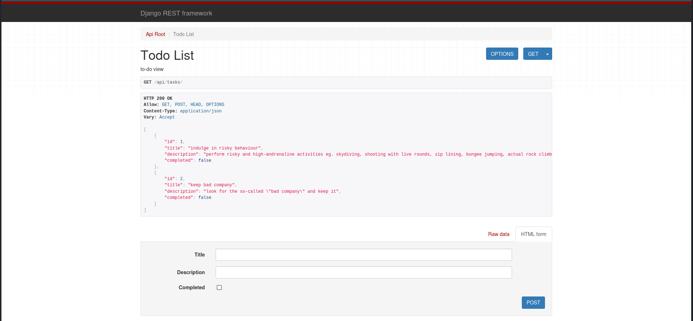

# 0x08-learn_py

create a simple [task manager]() using django RF (BE) and react.js (FE)

### stack
* python
* js (ESM)
* django (REST framework)
* react.js

### what you can do
* CRUD ops
    * add a task
    * see all tasks
    * see one task
    * edit a task
    * delete a task

### what you cannot do
* sort tasks by date, time etc
* delete all tasks

